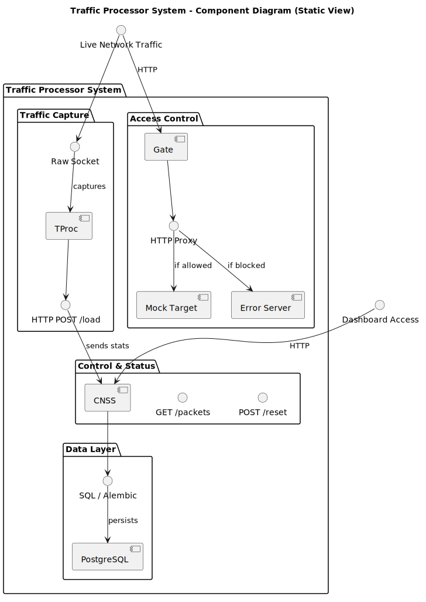
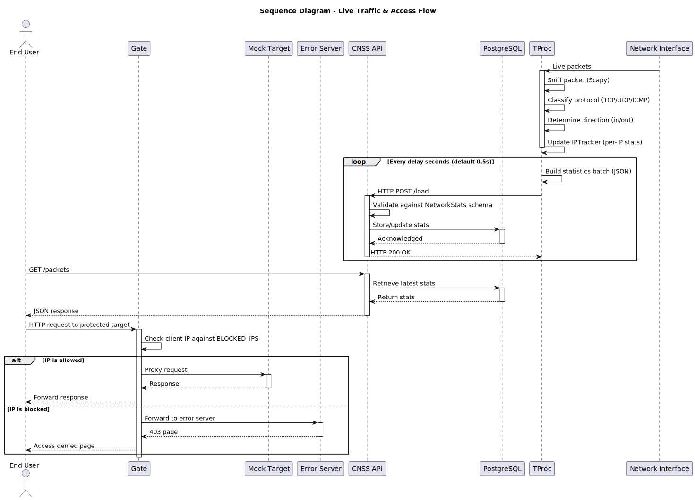
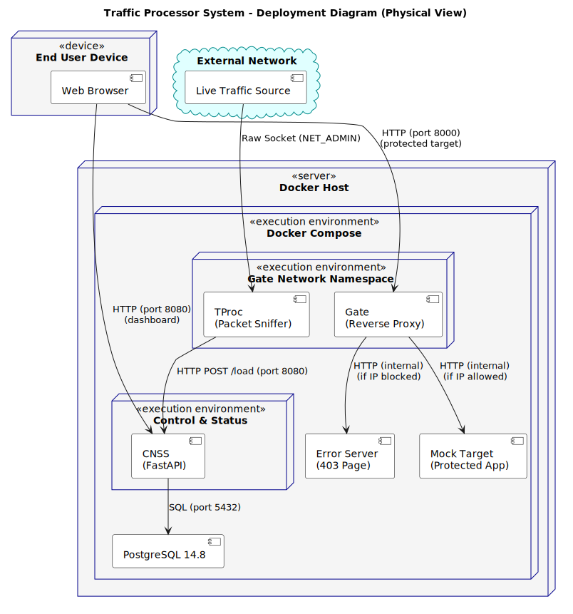

# Traffic Processor Architecture

This document describes the architecture of the Traffic Processor (TP) system.

## Overview

Traffic Processor is a network visibility and control tool that captures live packet counters, per-connection statistics, and traffic history. The system consists of three main components:

| Component | Description | Technology |
|-----------|-------------|------------|
| **TProc** | Packet sniffer that captures traffic, classifies packets, computes per-IP statistics, and sends data to CNSS. | Python, Scapy |
| **CNSS** | Control and Status Server – receives statistics, serves the web dashboard, and supports reset functionality. | FastAPI, PostgreSQL |
| **PostgreSQL** | Persistent storage for CNSS data. | PostgreSQL 14.8 |

## Architecture Views

### Static View

The static view describes the system's component structure, interfaces, and relationships.

- **Diagram:** [component-diagram.puml](static-view/component-diagram.puml)
- 

### Dynamic View

The dynamic view describes key runtime interactions and workflows, including packet capture, statistics transmission, and dashboard refresh.

- **Diagram:** [sequence-diagram.puml](dynamic-view/sequence-diagram.puml)
- 

### Deployment View

The deployment view describes the runtime deployment structure using Docker Compose with two containers (CNSS + PostgreSQL). TProc runs separately and can be deployed independently.

- **Diagram:** [deployment-diagram.puml](deployment-view/deployment-diagram.puml)
- 

## Key Architectural Decisions (ADRs)

| ADR | Title | Status |
|-----|-------|--------|
| ADR-001 | Asynchronous HTTP Communication Between TP and CNSS | Implemented |
| ADR-002 | PostgreSQL for Persistent Storage | Implemented |
| ADR-003 | Scapy as Packet Capture Library | Implemented |
| ADR-005 | Docker Compose for Multi-Service Orchestration | Implemented |

> **Note:** ADR-004 (Gate as Reverse Proxy with IP Filtering) has been **deprecated**.

## Running the System

From the `src` directory:

```bash
docker compose up --build
```

This starts CNSS and PostgreSQL. The dashboard is available at http://localhost:8080.

To run TProc separately:
```bash
cd src/Traffic_Processor
python tproc.py
```

TProc can be configured via environment variables:
- `INTERFACE` – network interface to capture from (default: `eth0`)
- `CNSS_URL` – CNSS endpoint URL (default: `http://cnss:8080/load`)
- `DELAY` – interval between data pushes in seconds (default: `1`)

## Endpoints

| Method | Endpoint | Description |
|--------|----------|-------------|
| POST | `/load` | Receive network statistics from TProc |
| GET | `/packets` | Retrieve current statistics |
| POST | `/reset` | Reset statistics (sets baseline) |
| GET | `/root` | Health check endpoint |
