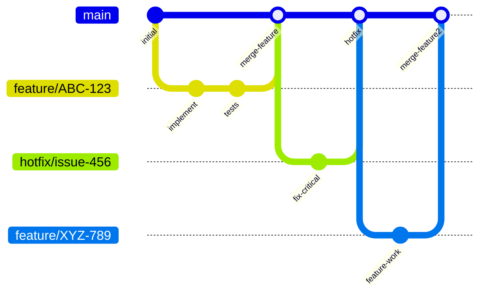

# Development Process

This document describes the **current** development process used by the team for this repository. It is the canonical, maintained artifact for both our development workflow and configuration‑management practices. All team members are expected to follow this process; any material change to the workflow must be reflected here.

---

## 1. Agile Planning & Backlog Management

We use **GitHub Projects** as our primary planning and tracking tool. The project board is configured with the following views:

- **Product Backlog** – a view of all open issues, prioritised by the Product Owner.
- **Sprint Backlog** – a filtered view showing issues selected for the current sprint.
- **Team Dashboard** – a personal view for each developer to see their assigned tasks.

The board contains these columns (statuses):

| Column          | Purpose                                                                                                 | Entry Criteria                                                                                  |
|-----------------|---------------------------------------------------------------------------------------------------------|-------------------------------------------------------------------------------------------------|
| **Backlog**     | All ideas, bugs, and feature requests not yet scheduled.                                                | Issue is created and triaged; has a clear description and acceptance criteria.                  |
| **Ready**       | Issues that are fully refined and estimated, ready to be pulled into a sprint.                          | Issue has been estimated, acceptance criteria are defined, and all dependencies are resolved.   |
| **In Progress** | Work actively being developed.                                                                          | Developer has created a feature branch and started coding.                                      |
| **Review**      | Code is ready for peer review (Pull Request is open).                                                   | PR is created, CI checks pass, and the PR template is filled.                                   |
| **Done**        | Work is complete, merged, and verified in the target environment (staging/production as appropriate).   | PR is merged, issue is closed, and deployment to the relevant environment is successful.        |

**Sprint cadence:** 2‑week sprints, starting every other Monday. Sprint planning happens on the first day of the sprint; sprint review and retrospective on the last day.

---

## 2. Git & Review Workflow

We use a **modified GitHub Flow** with a long‑lived `main` branch. All development work is done on short‑lived feature branches that are branched from and merged back into `main`. For hotfixes, we also branch directly from `main`.

### 2.1 Branching Strategy

The following diagram illustrates our branching and merging workflow:



**What the diagram shows:**

- All development starts from develop unless it is a hotfix (which starts from main).
- Feature branches are created from develop for new features, bug fixes, and chores.
- When a feature is complete, it is merged back into develop via a Pull Request.
- Periodically, we create a release/vX.Y branch from develop to prepare for a production release. Only bug fixes and documentation updates go into the release branch.
- The release branch is merged into main (tagged with the version) and then back into develop to keep them in sync.
- Hotfixes branch directly from main and are merged into both main and develop.

## 2.2 Issue Creation & Management

- Every piece of work (feature, bug, chore) must have a **GitHub Issue**.
- Issues must be labelled appropriately (`bug`, `enhancement`, `documentation`, `question`, etc.).
- Issues are assigned to a milestone (sprint) and a project board.
- The issue title should be descriptive and include the affected component if relevant.
- The issue description must include **acceptance criteria** and, if applicable, steps to reproduce.

## 2.3 Branch Creation & Naming

- Branches are created from the appropriate base branch (`develop` for features, `main` for hotfixes).
- Branch names follow the pattern:  
  `<type>/<issue-number>-<short-description>`  
  where `type` is one of: `feature`, `bugfix`, `hotfix`, `chore`, `docs`.
- Example: `feature/123-add-login-page`
- Use hyphens to separate words; keep the description concise.

## 2.4 Pull Requests (PRs)

All changes must be submitted via a **Pull Request** (PR) on GitHub.

- **PR title:** Should match the branch name or provide a clear summary.
- **PR description:** Use the template provided (automatically filled when opening a PR). It must include:
  - Link to the issue being addressed.
  - Summary of changes.
  - Testing instructions or evidence.
  - Screenshots for UI changes.
- **Draft PRs** may be used for work in progress, but they must be converted to “Ready for review” before asking for reviewers.
- **CI checks** must pass (see Section 6) before the PR can be merged.

## 2.5 Review Process

- At least **one approval** from a team member other than the author is required.
- Reviewers must check:
  - Code quality, style, and adherence to coding standards.
  - Test coverage (new and existing tests pass).
  - Security implications.
  - Documentation updates (if applicable).
- If changes are requested, the author addresses them and re‑requests review.
- Once approved and CI passes, the PR can be merged.

## 2.6 Merging & Closing Issues

- Merging is done via the **“Squash and merge”** option to keep the history clean, unless there is a reason to preserve individual commits (e.g., for a release branch, we may use “Merge commit”).
- After merging, the associated issue is automatically closed if the PR description included `Closes #<issue>`.
- The issue is moved to the **Done** column on the project board.

---

## 3. Configuration & Secrets Management

We manage configuration and secrets using a combination of environment variables and ignored files.

### 3.1 Secrets Storage

- **Secrets are never committed to the repository.** They are stored externally:
  - **GitHub Secrets** – used for CI/CD pipelines (e.g., access tokens, deployment keys).
  - **`.env` files** – used for local development; these files are listed in `.gitignore` and are never pushed.
- The `docker-compose.yml` file in the `src/` directory references environment variables for database credentials and other sensitive settings. In production, these variables are supplied via the deployment environment.

### 3.2 Ignored Files

The following files and directories are ignored by Git (via `.gitignore`):
- `.env` – local environment variables.
- `__pycache__/` – Python bytecode.
- `*.pyc` – compiled Python files.
- `*.log` – log files.
- `venv/`, `env/`, `.venv` – virtual environments.
- `coverage/`, `htmlcov/` – test coverage reports.
- `.pytest_cache/` – pytest cache.
- Any IDE‑specific folders (e.g., `.vscode/`, `.idea/`).

### 3.3 Runtime Configuration

- **Local development:** Configuration is supplied via a `.env` file (if present) or directly in the `docker-compose.yml` for quick prototyping.
- **Production/Staging:** Configuration is injected via environment variables set in the deployment platform (e.g., Docker secrets, Kubernetes secrets, or cloud provider environment variables).
- **Example configuration:** A sanitised example of required environment variables is documented in the `README.md` and in the `docker-compose.yml` itself (with placeholder values).

### 3.4 CI / Deployment Configuration

- CI pipelines are defined in `.github/workflows/main.yml` and `.github/workflows/link-checking.yml`.
- The `main.yml` workflow runs on every push to `main` and on every pull request targeting `main`. It installs dependencies, lints, runs tests, builds Docker images, and performs a smoke test.
- The `link-checking.yml` workflow runs on the same events and checks for broken links in all Markdown files.
- Deployment automation is not yet fully implemented; currently, the team manually deploys from the `main` branch after a successful CI run. Future work may introduce continuous delivery via GitHub Actions.

### 3.5 Committed Example Artifacts

- The `docker-compose.yml` file serves as a working example of how to run the application with all required services.
- The `README.md` provides quick‑start instructions and example commands.
- No real secrets or production credentials are committed.

## 4. Reproducible Development Environment

We use **Docker** and **Docker Compose** to provide a reproducible development environment.

- All services (Traffic Processor, CNSS, PostgreSQL) are defined in `src/docker-compose.yml`.
- To start the environment, run these commands:

```bash
   cd src
   docker compose up --build
```

- This builds the required images and starts all containers with the correct networking and volume mounts.
- For verification, you can run this command to see sample output from the Traffic Processor:

    ```bash
  docker exec tproc cat /data/data.txt | head -3
    ```

- The environment is self‑contained and does not require any system‑wide dependencies beyond Docker and Docker Compose.
- Python dependencies are managed via `pip` (for the Traffic Processor) and `poetry` (for CNSS), as seen in the CI workflow.

---

## 5. CI/CD Process

We use **GitHub Actions** for continuous integration and (partial) continuous delivery.

### 5.1 CI Pipeline

The `main.yml` workflow runs on:
- **Push** to the `main` branch.
- **Pull requests** targeting `main`.

The pipeline performs the following steps:
1. **Checkout** the code.
2. **Set up Python** (version 3.10).
3. **Install dependencies** – including `netifaces`, `scapy`, `pytest`, `flake8`, and CNSS dependencies via Poetry.
4. **Lint** with `flake8` (syntax‑only checks).
5. **Run tests** with `pytest`, generating coverage reports.
6. **Build Docker images** for all services.
7. **Run a smoke test** – start the containers, wait for them to initialise, and verify that all expected containers are running.

### 5.2 Additional Checks

The `link-checking.yml` workflow runs on the same events and checks all Markdown files for broken links.

### 5.3 Deployment Automation

Currently, we do **not** have fully automated continuous delivery. After a successful CI run on `main`, a team member manually triggers the deployment to the target environment (staging or production). We plan to introduce automated deployment via GitHub Actions in a future sprint.

---

## 6. Definition of Done

A work item (issue, user story, or task) is considered **Done** when **all** of the following criteria are met:

- All issue acceptance criteria are satisfied.
- The work is reviewed by another team member (at least one approval).
- For user stories, the linked supporting PBIs provide the required implementation, review, and verification evidence.
- Required tests or checks pass (CI pipeline is green).
- Verification evidence is preserved in the normal workflow artifacts (e.g., test reports, screenshots, logs).
- The associated PR is merged into `main`.
- The issue is closed (automatically via the PR or manually).
- The issue is moved to the **Done** column on the project board.

---

## 7. Traceability & Artifact Maintenance

- This `development-process.md` file is the **canonical** source of truth for our development process. Any changes to the workflow must be reflected here.
- All other process‑related documents (e.g., `definition-of-done.md`, `quality-requirements.md`, `testing.md`) are maintained in the `docs/` folder.
- The repository uses **issues** and **pull requests** to maintain traceability between code changes, requirements, and user stories.
- Each PR must link to at least one issue, and each issue must be linked to a project board column.

---

*This document is maintained by the team and is subject to change as our process evolves. Last updated: 2026-06-30.*
