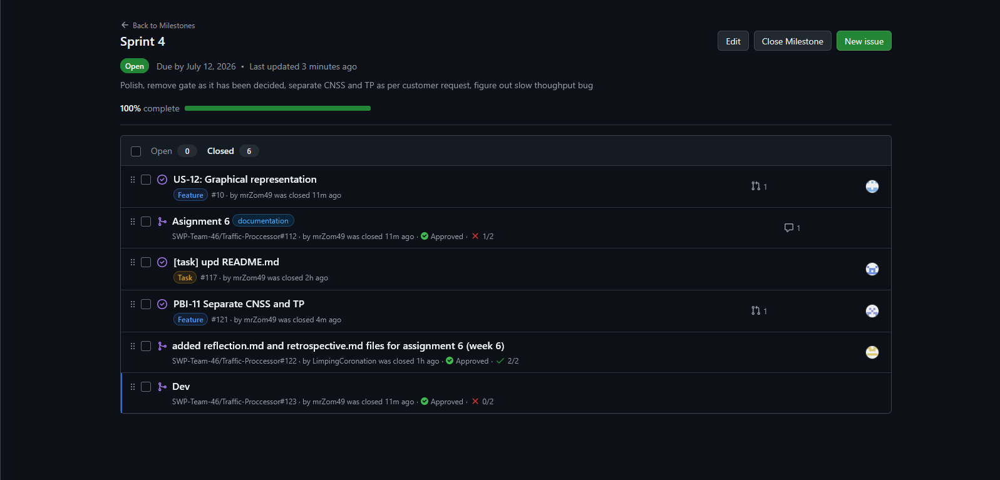
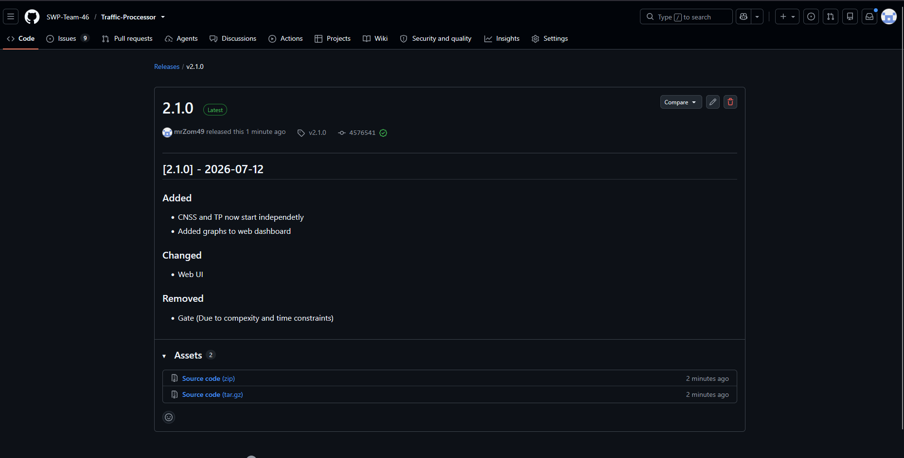
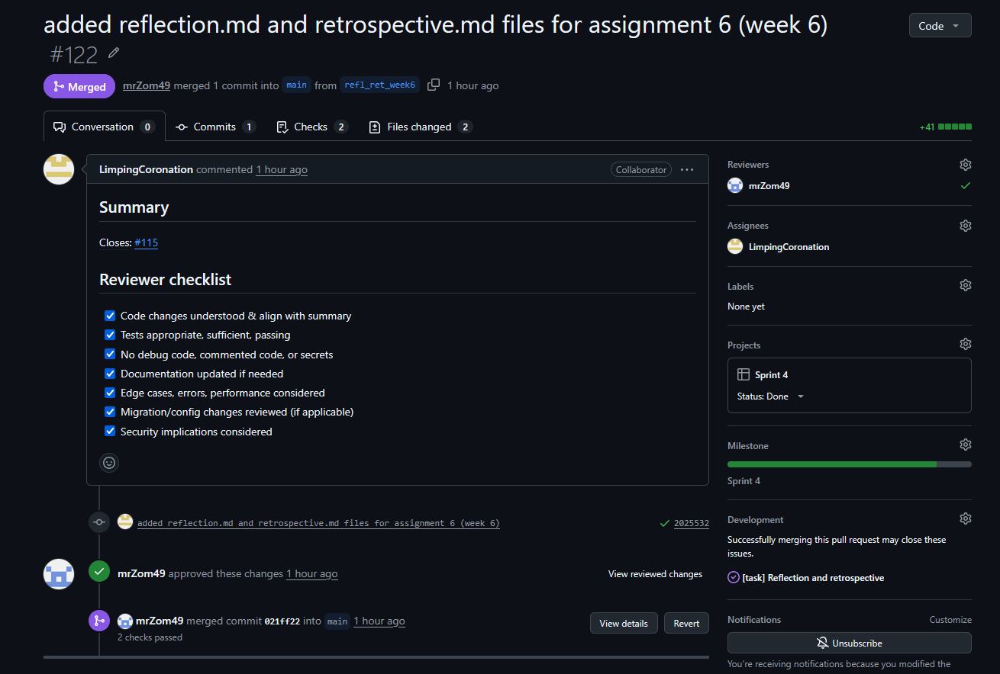

1. **Traffic Processor** – a network visibility and control tool that captures live packet counters, per‑connection statistics, and traffic history, while supporting blocking, tunneling, and failover behaviours

2. **[Product Backlog view](https://github.com/SWP-Team-46/Traffic-Proccessor/issues?q=is%3Aissue)**

3. **[Sprint 4 view](https://github.com/orgs/SWP-Team-46/projects/4)**

4. **[Sprint 4 milestone](https://github.com/SWP-Team-46/Traffic-Proccessor/milestones/4)**

5. **Sprint 4 Goal, Sprint dates, and short scope summary.**  
   - **Dates:** 6 July 2026 – 12 July 2026
   - **Goal / Scope:** General improvement on MVP v2, preparations for customer handover

6. **Total Sprint 4 size in Story Points: 13**  
   
7. **Summary of the Week 6 trial-release changes.**  
   The Week 6 trial release corresponds to version **2.1.0**. Key changes include:
   - Separated CNSS and TP startup
   - Website UI overhaul
8. [**Link to the Week 6 product access artifact**](http://localhost:38080/static/index.html)

9. **Current access or run instructions.**  
   See the main [README](https://github.com/SWP-Team-46/Traffic-Proccessor/blob/Asignment-6/README.md) for detailed setup and usage instructions

10. **[README](/README.md)**

11. **[CONTRIBUTING](/CONTRIBUTING.md)**

12. **[AGENTS](/AGENTS.md)**

13. **[Handover](/docs/customer-handover.md)**

14. [**Link to the hosted documentation site**](https://github.com/SWP-Team-46/Traffic-Proccessor)

15. Customer thought README was sparse, but other parts were alright

16. **Transition-readiness summary, including what must still happen in Week 7**  
    - Formal handover to the customer is in progress
    - Week 7 follow‑up work: Bug-fixes, add data storage, try to add VM-to-VM compatability

17. Due to customer feedback [PBI-11](https://github.com/SWP-Team-46/Traffic-Proccessor/issues/121) was created

18. All customer feedback has been addressed

19. **[Roadmap](/docs/roadmap.md)**

20. **Link to the maintained quality, testing, architecture, development-process, and other customer-relevant documentation updated during Sprint 4**  
    See the `docs/` folder:
    - [Architecture Overview](/docs/architecture)
    - [Testing & Quality](/docs/testing.md)
    - [Roadmap](/docs/roadmap.md)
    - [User Acceptance Tests](/docs/user-acceptance-tests.md)

21. All documented UATs have passed

22. [Release `v2.1.0`](https://github.com/SWP-Team-46/Traffic-Proccessor/releases/tag/v2.1.0)

23. **[CHANGELOG](/CHANGELOG.md)**

24. **[Sprint Review transcript](sprint-review-transcript.md)**

25. **[Sprint Review Summary](sprint-review-summary.md)**

26. **[Reflection](reflection.md)**

27. **[Retrospective](retrospective.md)**

28. **[LLM report](llm-report.md)**

29. **Summary of the current product status and expected Week 7 follow-up work.**  
    - **Current status:** The system is fully containerised and includes TProc, CNSS, and PostgreSQL
    - **Week 7 follow‑up:** Bug fixes, finishing touches, try to add VM-to-VM compatability, store statistics in database

30. **Contribution traceability table mapping each team member to issues, PRs or MRs, review activity, testing, documentation, transition, or deployment work.**  

31. **Screenshots from `reports/week6/images/` for the Sprint milestone, Week 6 release, example reviewed issue-linked PR**  

<!--
1. Project name and short description.
2. Link to the Product Backlog board or view.
3. Link to the Sprint 4 Backlog board or view.
4. Link to the Sprint 4 milestone.
5. Sprint 4 Goal, Sprint dates, and short scope summary.
6. Total Sprint 4 size in Story Points.
7. Summary of the Week 6 trial-release changes.
8. Link to the Week 6 product access artifact.
9. Link to current access or run instructions.
10. Link to `README.md`.
11. Link to `CONTRIBUTING.md`.
12. Link to `AGENTS.md`.
13. Link to `docs/customer-handover.md`.
14. Link to the hosted documentation site.
15. Summary of the customer-facing documentation review, including what the customer found clear, unclear, or missing.
16. Transition-readiness summary, including what must still happen in Week 7.
17. Customer feedback response table with feedback points and resulting PBIs or issues.
18. Explanation of feedback not yet addressed.
19. Link to `docs/roadmap.md`.
20. Link to the maintained quality, testing, architecture, development-process, and other customer-relevant documentation updated during Sprint 4.
21. Summary of relevant UAT or customer-trial results.
22. Link to the Week 6 SemVer trial release.
23. Link to `CHANGELOG.md`.
24. Link to the published Sprint Review transcript or a statement that publication was refused and the transcript is shared only through Moodle or another approved private instructor-sharing channel, or a link to the Sprint Review notes if recording or private sharing was refused.
25. Link to `reports/week6/sprint-review-summary.md`.
26. Link to `reports/week6/reflection.md`.
27. Link to `reports/week6/retrospective.md`.
28. Link to `reports/week6/llm-report.md`.
29. Summary of the current product status and expected Week 7 follow-up work.
30. Contribution traceability table mapping each team member to issues, PRs or MRs, review activity, testing, documentation, transition, or deployment work.
31. Embedded screenshots from `reports/week6/images/` for the Sprint milestone, Week 6 release, example reviewed issue-linked PR or MR, and other inspectable Week 6 evidence where public links may not be reliably inspectable.
-->
